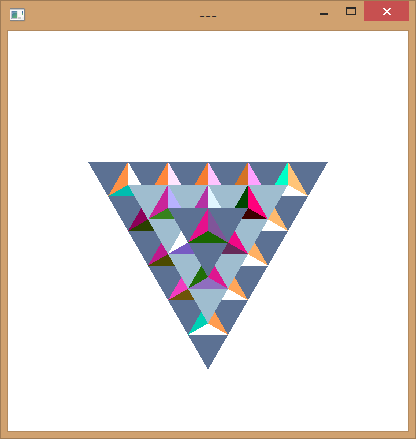
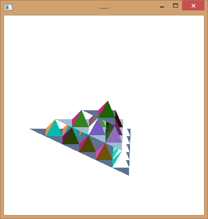
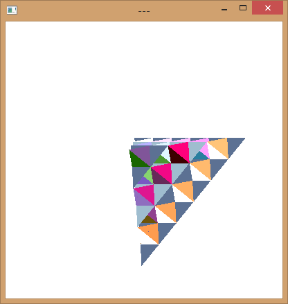
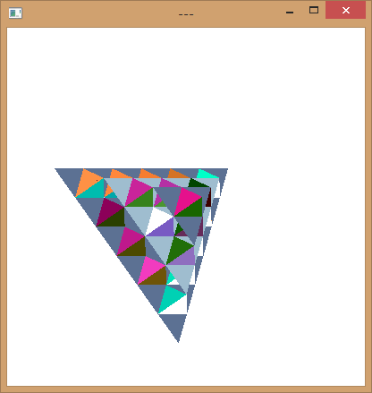

# 3D Extension of the Koch Curve

## Overview
This project visualizes a 3D fractal pyramid based on the Koch curve, using OpenGL. Users can interact with the model by rotating it via mouse controls.

## Features
- **Fractal Generation:** Recursive subdivision of a 3D pyramid.
- **Dynamic Visualization:** Interactive rotation with real-time rendering.
- **Colorful Display:** Each face of the pyramid is rendered with varying colors.

## Usage
- **Rotate Model:** Click and drag with the left mouse button.
- **Exit:** Close the window.

## Results
Below are some rendered images of the 3D fractal pyramid:

|  |  |
|-------------|-------------|
|  |  |

## Code Structure
- **main()**: Initializes OpenGL, sets up display, and starts the main loop.
- **display()**: Renders the scene by calling `divide_pyramid()`.
- **divide_pyramid()**: Recursively subdivides the pyramid and calls `pyramid()` for rendering.
- **pyramid()**: Draws a single pyramid using triangles.
- **mouse()**: Handles rotation via mouse input.
- **myReshape()**: Maintains aspect ratio when resizing the window.

## Dependencies
- **OpenGL**: 3D rendering library
- **GLUT**: Utility toolkit for OpenGL
- **GLAUX**: Additional utilities for OpenGL
